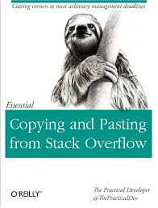

% Erweiterungen Eine geführte Wanderung duch die Strukturen von Contao
% Andreas Fieger (@fiedschMuc)
% 2016-04-14

# Contao Erweiterung

<!-- Modifiziertes Styling (für alle Seiten) -->
<!-- Code auf der ersten Folie, sonst wird eine leere Folie erzeugt -->

  - Backend
    - (Daten-)Tabellen
    - Übersichten
  - Frontend
    - ContentElemente
    - Module
    - Formularfelder (Widgets)
    - Inserttags
  - Allgemein
    - (Daten-)Modelle      

# Genereller Aufbau

- eigenes Verzeichnis in `system/modules/`

- mit Unterverzeichnissen
  - `config`
  - `dca`
  - `languages/{en,de}`
  - `assets`
  - `classes`
  - `elements`
  - `models`
  - `modules`
  - `templates`
  - `widgets`

# Am “einfachsten”

# Wie?

etwas suchen, das

- dem Gewünschten nahe kommt

- möglichst simpel erscheint (was soll passieren)

- möglichst simpel ist (wie viel Code wurde benötigt)

- Tools verwenden (z.B. `grep`)

# Abschauen = lernen

do not simply copy/paste!

Zu viel einfügen erzeugt unnötig komplizierten Code der
schlimmstenfalls _trotzdem funktioniert_ (für mich: CSS).

# Welche Bereiche gibt es?

# Backend

- Datenerfassung => eigene Tabelle

- Übersichtsseite wie z.B. die “Startseite”

# Frontend

- ContentElement
- Modul
- Formularfeld
- Inserttag

# Contao Komponenten

- DCA
- Konfiguration
- ContentElemente
- Module
- uvm.

# DCA

- Data Container Array
- Array mit allen Informationen, die Contao sagen, wie eine Datentabelle
darzustellen und zu verwalten ist.
- wird ggf. aus Einzelteilen zusammengebaut (core + Extension; gleicher Dateiname!)
-  DCA + Konfiguration = Backendtabelle.
- Backendtabelle stellt Daten für Frontendmodul bereit

# DCA (Minimal-)Beispiel

~~~ {.php}
<?php
// system/modules/core/dca/tl_cron.php
$GLOBALS['TL_DCA']['tl_cron'] = array
(

	// Config
	'config' => array
	(
		'sql' => array
		(
			'keys' => array
			(
				'id' => 'primary',
				'name' => 'unique'
			)
		)
	),

	// Fields
	'fields' => array
	(
		'id' => array
		(
			'sql'                     => "int(10) unsigned NOT NULL auto_increment"
		),
		'name' => array
		(
			'sql'                     => "varchar(32) NULL"
		),
		'value' => array
		(
			'sql'                     => "varchar(32) NOT NULL default ''"
		)
	)
);
~~~~

# Abschnitte im DCA

## Übersicht
~~~ {.php}
// system/modules/*/dca/tl_*.php ; 
$GLOBALS['TL_DCA']['tl_tabellenname']['config'] = array(/* ... */);

$GLOBALS['TL_DCA']['tl_tabellenname']['list'] = array(/* ... */);

$GLOBALS['TL_DCA']['tl_tabellenname']['palettes'] = array(/* ... */);

$GLOBALS['TL_DCA']['tl_tabellenname']['subpalettes'] = array(/* ... */);

$GLOBALS['TL_DCA']['tl_tabellenname']['fields'] = array(/* ... */);

// ja, es gibt noch mehr ...
~~~~

## `config`

~~~ {.php}
// system/modules/core/dca/tl_member.php ; $GLOBALS['TL_DCA']['tl_member']
'config' => array
(
  'dataContainer'     => 'Table',
  'enableVersioning'  => true,
  'onsubmit_callback' => array
  (
    array('tl_member', 'storeDateAdded'),
    array('tl_member', 'checkRemoveSession')
  ),
  'ondelete_callback' => array
  (
    array('tl_member', 'removeSession')
  ),
  'sql' => array
  (
    'keys' => array
    (
      'id'         => 'primary',
      'username'   => 'unique',
      'email'      => 'index',
      'autologin'  => 'unique',
      'activation' => 'index'
    )
  )
),
~~~~

## `list`

~~~ {.php}
// system/modules/core/dca/tl_member.php ; $GLOBALS['TL_DCA']['tl_member']
'list' => array
(
  	'sorting' => array(/* ... */),
  	'label' => array(/* ... */),
  	'global_operations' => array(/* ... */),
  	'operations' => array(/* ... */),
),
~~~~

## `palettes` und `subpalettes`

~~~ {.php}
// system/modules/core/dca/tl_member.php ; $GLOBALS['TL_DCA']['tl_member']
// Palettes
'palettes' => array
(
  '__selector__'  => array('login', 'assignDir'),
  'default'       => '{personal_legend},firstname,lastname,dateOfBirth,gender; ... ;{login_legend},login;{homedir_legend:hide},assignDir;{account_legend},disable,start,stop',
),

// Subpalettes
'subpalettes' => array
(
  'login'         => 'username,password',
  'assignDir'     => 'homeDir'
),
~~~~

## `fields`

~~~ {.php}
// system/modules/core/dca/tl_member.php ; $GLOBALS['TL_DCA']['tl_member']
'email' => array
(
  'label'        => &$GLOBALS['TL_LANG']['tl_member']['email'],
  'exclude'      => true,
  'search'       => true,
  'inputType'    => 'text',
  'eval'         => array('mandatory'=>true, 'maxlength'=>255, 'rgxp'=>'email',
                          'unique'=>true, 'decodeEntities'=>true, 'feEditable'=>true,
                          'feViewable'=>true, 'feGroup'=>'contact', 'tl_class'=>'w50'),
  'sql'          => "varchar(255) NOT NULL default ''"
),
~~~~

# Konfiguration

## 
- Backendmodule
- ContentElemente
- FrontendModule
- uvm.

## Backendmodule

~~~ {.php}
// system/modules/myextension/config/config.php
$GLOBALS['BE_MOD'] = array(/* ... */);

// Bsp.:
$GLOBALS['BE_MOD']['system']['files'] = array
  (
    'tables'      => array('tl_files')
  );
// plus Eintrag in languages/*/modules.php (oder *.xlf)
// $GLOBALS['TL_LANG']['MOD']['tl_files'][0] = 'Dateiverwaltung';
// $GLOBALS['TL_LANG']['MOD']['tl_files'][1] = 'Dateien und Ordner verwalten ...';
~~~~

## ContentElemente

~~~ {.php}
// system/modules/myextension/config/config.php
$GLOBALS['TL_CTE'] = array(/* ... */);
// Bsp.:

$GLOBALS['TL_CTE']['texts']['text'] = 'ContentText';
// wieder plus Eintrag in languages/*/tl_content.php (oder *.xlf)
~~~~

## FrontendModule

~~~ {.php}
// system/modules/myextension/config/config.php
$GLOBALS['FE_MOD'] = array(/* ... */);

// Strukturell wie $GLOBALS['TL_CTE']
~~~~

## und ...

- Formularfelder (`$GLOBALS['BE_FFL']` und `$GLOBALS['TL_FFL']`)
- Seitentypen (`$GLOBALS['TL_PTY']`)
- Wartungsarbeiten (`$GLOBALS['TL_MAINTENANCE']`, `$GLOBALS['TL_PURGE']`,
`$GLOBALS['TL_CRON']`)
- Hooks (`$GLOBALS['TL_HOOKS']`; Onlinehandbuch!)
- Besondere Darstellung für Wrapper (`$GLOBALS['TL_WRAPPERS']`)

# Programmieren

ContentElement oder Modul implementieren

~~~ {.php}
// system/modules/myextension/{elements,modules}/My{Element,Module}.php

protected $strTemplate = 'mein_template'; // Namenskonvention, Basisname

protected function generate() { /* ... */ }

protected function compile() { /* ... */ }
~~~~

# Templates

schreiben

~~~ {.php}
// system/modules/myextension/templates/*.html5
~~~~

# Autoloader

erzeugen (lassen)!

~~~ {.php}
// system/modules/myextension/config/autoload.{ini,php}
~~~~

# Ausblick

- [GitHub Profil](https://github.com/ContaoBayern/]  
- Repository `contao_table_from_csv`
- Eine simple Implementierung eines ContentElements
- Als Beispielcode oder Basis für eine "echte" Implementierung

# Fragen

<!-- hier nachhalten, was diskutiert wurde -->

# Links

- https://docs.contao.org/en/ (Developer Documentation)
- http://contao.ninja/files/contao-konferenz/2014/Contao_Konferenz_2014_-_Erweiterungen_entwickeln_für_Contao_leicht_gemacht.pdf
- https://github.com/fiedsch/contao_table_from_csv

# Danke
